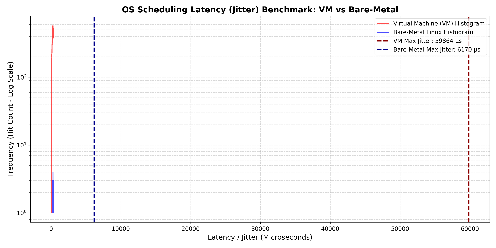

# OS-Jitter-Benchmarking-for-Robotics

A direct benchmarking project comparing standard Linux timer jitter on a Virtual Machine versus a native bare-metal dual-boot setup. By measuring microsecond scheduling delays during high CPU and RAM stress, this repository highlights the practical impact of virtualization on timing stability and evaluates baseline OS suitability for time-critical robotic controllers.

## 🎯 Objective
To experimentally characterize the scheduling latency (jitter) of a standard Linux kernel under heavy computational load. 

At a standard 1 kHz industrial control frequency, a robotic controller expects a position update exactly every 1,000 microseconds (1 ms). This comparison evaluates whether a standard virtualized or bare-metal OS environment can guarantee that deterministic operating envelope before deploying middleware like ROS 2 or DDS.

## ⚙️ Methodology & Test Environments
The benchmark evaluates the OS scheduler's ability to wake a sleeping thread exactly on time while the system is saturated with extreme artificial stress.

*   **Workload Simulation (`stress-ng`):** 
    Used to simulate a heavy industrial compute load running in the background (stressing CPU, I/O, and Virtual Memory).
    `stress-ng --cpu 4 --io 2 --vm 1 --vm-bytes 1G --timeout 100s`
*   **Latency Measurement (`cyclictest`):** 
    Used to trigger a timer every 1,000 µs for 100,000 cycles using `SCHED_FIFO` real-time priority, measuring the exact microsecond delay of the OS response.
    `sudo cyclictest -l100000 -m -Sp90 -i1000 -h400 -q`

**Environments Tested:**
1.  **Virtual Machine:** Ubuntu (Standard Kernel)
2.  **Bare-Metal (Dual-Boot):** ASUS ROG Strix G513RM (Standard Kernel)

## 📊 Results & Data Comparison

*(Logarithmic histogram showing the massive 60 ms outlier in the VM environment compared to bare-metal normal behavior).*

| Metric | Virtual Machine (Ubuntu) | Bare-Metal (ASUS ROG) |
| :--- | :--- | :--- |
| **Average Latency** | ~720 µs | 2 - 4 µs |
| **Max Jitter (Worst-Case)** | 59,864 µs (~60 ms) | 6,170 µs (~6.1 ms) |
| **Histogram Overflows** (>400 µs)| > 68,000 | < 50 on most threads |
| **1 kHz Control Loop Impact** | Missed ~60 consecutive deadlines | Missed ~6 consecutive deadlines |

## 🚀 Industrial Consequence & Conclusion
The data demonstrates the severe impact of virtualization overhead on timing determinism. 

Under simulated load, the virtual machine's OS scheduler was interrupted for nearly 60 milliseconds at its absolute worst. In a 1 kHz distributed robotics system, this means the control software effectively goes blind for 60 consecutive cycles. On a physical machine, missing 60 control deadlines would cause a high-speed robotic arm to deviate entirely from its spatial trajectory, leading to a catastrophic hardware crash.

Running the exact same load directly on bare-metal hardware yielded a 10x improvement in worst-case jitter (dropping from 60 ms to 6.1 ms). However, because the system relies on a standard Linux kernel managing background OS tasks and hardware interrupts, it still produced microsecond spikes that exceed a strict 1 ms deadline. 

**Conclusion:** This benchmark mathematically validates that while bare-metal hardware vastly outperforms virtualized environments, deploying safe, high-speed motion control ultimately requires either a `PREEMPT_RT` patched kernel or strict user-space CPU core isolation. 

---
*Project conducted by Vishal Chandar SURESH as part of ongoing his personal research in industrial mechatronics and control systems.*
